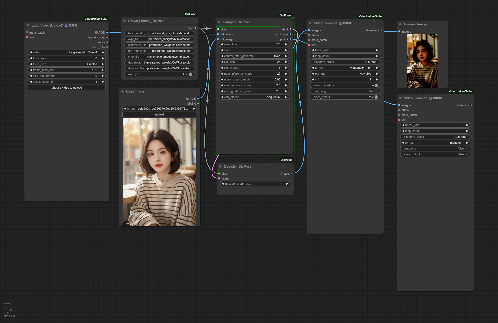

## ComfyUI-Allegro
ComfyUI supports over lihxxx/DisPose, which generates a new video with a reference video as poses and a reference image as everything else.

## Installation

_Assuming that you are under your ComfyUI root directory_
```
git clone https://github.com/bombax-xiaoice/ComfyUI-DisPose custom_nodes/ComfyUI-DisPose

pip install -r custom_nodes/ComfyUI-DisPose/requirements.txt
```
_You can download model files from huggingface or its mirror site beforehand, or just wait for the first run of (Down)Loader Disposeto download them_

```
mkdir custom_nodes/ComfyUI-DisPose/pretrained_weights

cd custom_nodes/ComfyUI-DisPose/pretrained_weights

git lfs clone https://huggingface.co/stable-diffusion-v1-5/stable-diffusion-v1-5

git lfs clone https://huggingface.co/stabilityai/stable-video-diffusion-img2vid-xt-1-1

git lfs clone https://huggingface.co/yzd-v/DWPose

wget https://huggingface.co/lihxxx/DisPose/blob/main/DisPose.pth

wget https://huggingface.co/tencent/MimicMotion/blob/main/MimicMotion_1-1.pth

wget https://huggingface.co/MyNiuuu/MOFA-Video-Hybrid/resolve/main/models/cmp/experiments/semiauto_annot/resnet50_vip%2Bmpii_liteflow/checkpoints/ckpt_iter_42000.pth.tar -O custom_nodes/ComfyUI-DisPose/mimicmotion/modules/cmp/experiments/semiauto_annot/resnet50_vip+mpii_liteflow/checkpoints/ckpt_iter_42000.pth.tar
```

## Example Workflow
Drag the following image into comfyui, or click Load for custom_nodes/ComfyUI-DisPose/dispose-comfy-example.json



Results run under comfy

https://github.com/user-attachments/assets/0e36a3c1-f0c4-4d2b-afe9-b3dc219d6e43

## Assessment

DisPose had done some very good engineering magics to allow more precise controls on AIGC video clips, at least better than any other open source solution available for now. Unfortunately, the base models DisPose uses are SD1.5 and SVDXT1.1, which are years old and definitely not the state-of-art solutions even within the open source world. Therefore, defects in details, including face, hairs, clothes and physics are still here and there in its output videos. On way is to wait for the DisPose team to deliver new versions on top of better base models. Before that, another way is to repaint the DisPose output (keeping all frames or one out of every N frames as input reference) with some other state-of-arts models such as Allegro or NVidia Cosmos. If face identity is critical, one may also need to repaint face by every frame using LORA+ControlNet+FaceDetailer. (There are many mature comfy pipelines available online)

## Tips
1. Only verified resolution 576 (other resolution seems to work very poorly), aspect ratio is hard coded to 9/16. Output is w=576/h=1024 if reference image has smaller width than height, and w=1024/h=576 if reference image has larger width than height, and w=576/h=576 if reference image has same width and height.

2. Original demo provided by lihxxx set tile_size=16 (frames) and tile_overlap=6. Larger tile_size leads to smoother motion at the cost of more VRAM consumption. Larger tile_overlap improves motion continuity at the cost of more computation time.

3. In case of CUDA out of memory, first try setting cpu_offload as _model_ to save some VRAM without apparent slow-down. If OOM still persists, try setting cpu_offload as _sequential_ to more aggresively save VRAM at the cost of slower computation time. If time is not a big concern, it is recommended to use cpu_offload = _sequential_ and try tile_size as large as possible until running out of VRAM.

4. Sampler_DisPose has 3 outputs, latent is the must-have output forwarded to Decoder_DisPose. ref_image (cropped and normalized) and poses (video of keypoints) are (useless) intermediate results helping to understand how DisPose works.
